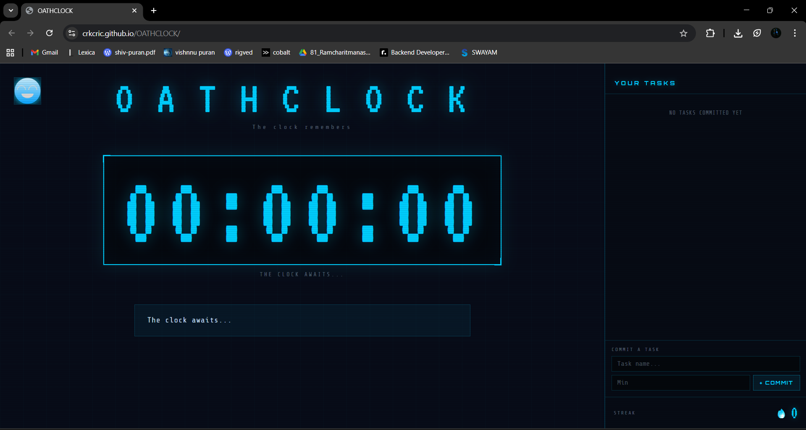
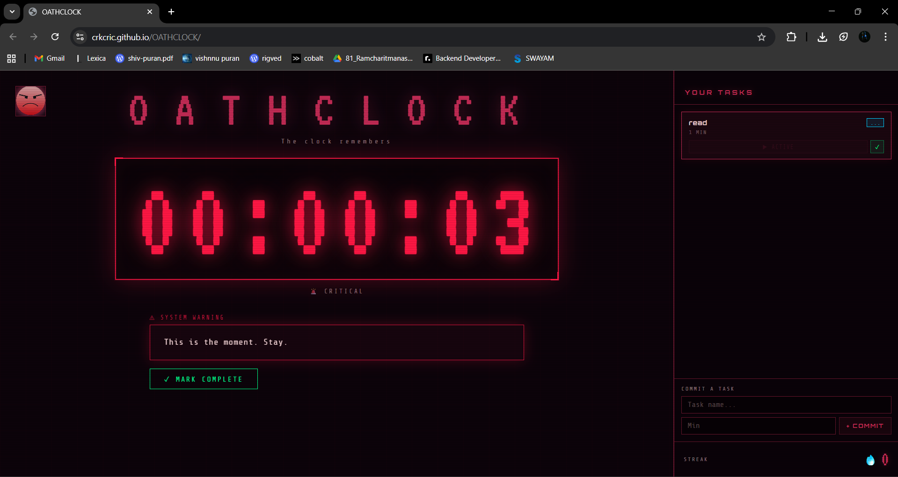

# OATHCLOCK 🎯

## Basic Details

**Team Name:** Ink&Ivory

### Team Members
- **Member 1:** C R Krishna - ASIET
- **Member 2:** Hrithika E B - ASIET

### Hosted Project Link
https://crkcric.github.io/OATHCLOCK/

---

## Project Description

OATHCLOCK is a gamified commitment system built as a retro-style dashboard that tracks tasks against a live countdown timer. As time runs out, the entire interface shifts — colors, theme, and tone — from calm neon blue to deep crimson, building dramatic tension and making every second feel accountable.

---

## The Problem Statement

Most productivity tools are too soft. They reward you for showing up, not for finishing. There's no real consequence for abandoning a task mid-way, which makes it easy to stall, procrastinate, or quit without feeling the weight of that decision.

---

## The Solution

OATHCLOCK introduces a commitment ritual — you set a task, start the clock, and the system watches. The UI itself shifts in real time as your deadline approaches: colors bleed from neon blue to crimson, the page darkens, the timer pulses, and the system speaks. If you fail, it tells you so — directly and without comfort. If you succeed, it celebrates. Every session is a small oath. The system remembers.

---

## Technical Details

### Technologies / Components Used

#### Software

| Category | Details |
|---|---|
| **Languages** | HTML5, CSS3, Vanilla JavaScript (ES6+) |
| **Frameworks** | None — pure vanilla stack |
| **Libraries** | Google Fonts (VT323, Orbitron, Share Tech Mono) |
| **Tools** | VS Code, Git, GitHub |

#### Hardware
> No hardware components required. Runs entirely in the browser.

---

## Features

- **⏱ Live Countdown Timer** — Large arcade-style digital clock with a decorative border box; dominates the UI hierarchy
- **🎨 Full-Page Real-Time Theme Shift** — The entire interface (panels, text, borders, title, buttons, theme icon) slowly morphs from neon blue → crimson as time runs out, driven by interpolated CSS custom properties updated every second
- **📋 Task Management System** — Up to 3 tasks with queue badges (`...` running, `!` queued, `✓` done); only one task runs at a time
- **💀 Failure Mode** — Timer hitting zero triggers a full visual transformation, streak reset, and a full-screen overlay with a five-line lecture before redemption is allowed
- **🔥 Streak Counter** — Tracks consecutive completions; resets visibly on failure
- **🎉 Confetti on Completion** — Marking a task done within the time window triggers confetti and a congratulatory system message
- **💬 Sassy Idle Messages** — System taunts the user when they stall before starting, escalating in severity over time
- **🖼 Dual Theme Icons** — Two PNG slots (default + failure) that crossfade as the clock runs down, slowest of all visual layers

---

## Implementation

### Installation

No installation required. All files are static — just open in a browser.

```bash
# Clone the repository
git clone https://github.com/CRKcric/OATHCLOCK.git

# Navigate into the project folder
cd tinkherhack 2026
```

### Run

```bash
# Option 1 — Open directly
open index.html

# Option 2 — Serve locally with VS Code Live Server
# Install the Live Server extension, right-click index.html → Open with Live Server

# Option 3 — Python simple server
python -m http.server 8000
# Then visit http://localhost:8000
```

### File Structure

```
oathclock/
├── index.html       # Markup and layout
├── style.css        # All styles, animations, CSS custom property system
├── app.js           # All game logic, state, theme shift engine
└── icons/
    ├── theme-default.png   # Icon shown in normal mode
    └── theme-failure.png   # Icon shown as time runs out
```

---

## Project Documentation

### Screenshots


*Default idle state — neon blue theme, clock awaiting first task commit*


*Task running — page has begun its slow shift toward orange/crimson at 40% remaining*


*Failure overlay — full crimson theme, "YOU SAID YOU WOULD." headline, lecture box visible*

---

### Diagrams

#### System Architecture

```
┌─────────────────────────────────────────────────────────┐
│                        index.html                        │
│         (Layout: 75% left panel / 25% right panel)      │
└──────────────┬──────────────────────────┬───────────────┘
               │                          │
       ┌───────▼───────┐         ┌────────▼────────┐
       │   style.css    │         │     app.js       │
       │                │         │                  │
       │ CSS Custom     │◄────────│ Theme Shift      │
       │ Properties     │ writes  │ Engine           │
       │ (--live-*)     │ every   │ (applyPageShift) │
       │                │ tick    │                  │
       │ 4s transitions │         │ Game State       │
       │ on all elements│         │ (phase, tasks,   │
       └───────────────┘         │  streak, timer)  │
                                 │                  │
                                 │ setInterval(1s)  │
                                 │ → checkPhase()   │
                                 │ → interpolate    │
                                 │   RGB palettes   │
                                 └──────────────────┘
```

*CSS custom properties act as the bridge — JS writes raw RGB values every second, CSS transitions on every consuming element create the natural visual lag that makes the page feel slower than the clock.*

#### Application Workflow

```
User Opens App
      │
      ▼
  IDLE STATE ──── No tasks? Sassy idle messages fire after 25s
      │
      │  Add Task (max 3)
      ▼
  TASK QUEUED (! badge)
      │
      │  Click START
      ▼
  RUNNING (... badge) ──────────────────────────────────────┐
      │                                                      │
      │  Every second:                                       │
      │  • Timer counts down                                 │
      │  • applyPageShift(pct) writes CSS vars               │
      │  • Page bleeds neon → crimson (starts at 70%)        │
      │  • Timer digit shifts neon → orange (starts at 100%) │
      │  • Theme icon crossfades (starts at 60%)             │
      │                                                      │
      ├── 50% remaining → Halfway message fires              │
      ├── 25% remaining → WARN phase (orange timer + glow)   │
      ├── 10% remaining → CRIT phase (crimson shake + pulse) │
      │                                                      │
      ├──── User clicks MARK COMPLETE ──────────────────────►│
      │          │                                           │
      │          ▼                                           │
      │     ✓ badge, streak++, confetti, page resets to neon │
      │                                                      │
      └──── Timer hits 0:00 ────────────────────────────────►│
                 │                                           │
                 ▼                                           │
           FAILURE STATE                                     │
           • Page snaps to full crimson (pinPageToDoom)      │
           • Streak resets to 0                              │
           • Overlay: "YOU SAID YOU WOULD."                  │
           • REDEEM → Lecture (5 lines)                      │
           • REDEEM FOR REAL → page fades back to neon       │
           • User must restart manually                      │
                                                            ◄┘
```

---

## Project Demo

### Video


The demo walks through the full OATHCLOCK experience:
- Adding tasks and committing to the clock
- The live page theme shift as time runs down — panels, title, borders, and timer all bleeding from neon blue to crimson
- The 25% warn phase (orange glow) and 10% critical phase (shake + pulse)
- Marking a task complete mid-timer — confetti, congrats message, streak increment
- Letting the timer hit zero — full failure transformation, overlay lecture, and the redemption flow back to calm

---

## AI Tools Used

**Claude (Anthropic)** - Primary development assistant across the entire project 
**ChatGPT** - Message pool
---

## License

This project is licensed under the **MIT License** — see the [LICENSE](LICENSE) file for details.

```
MIT License

Copyright (c) 2025 Ink&Ivory

Permission is hereby granted, free of charge, to any person obtaining a copy
of this software and associated documentation files (the "Software"), to deal
in the Software without restriction, including without limitation the rights
to use, copy, modify, merge, publish, distribute, sublicense, and/or sell
copies of the Software, and to permit persons to whom the Software is
furnished to do so, subject to the following conditions:

The above copyright notice and this permission notice shall be included in all
copies or substantial portions of the Software.

THE SOFTWARE IS PROVIDED "AS IS", WITHOUT WARRANTY OF ANY KIND, EXPRESS OR
IMPLIED, INCLUDING BUT NOT LIMITED TO THE WARRANTIES OF MERCHANTABILITY,
FITNESS FOR A PARTICULAR PURPOSE AND NONINFRINGEMENT.
```

---

## Team

Built with dramatic tension and intentional discomfort. The system is not here to comfort you. It is here to make sure you show up.

---